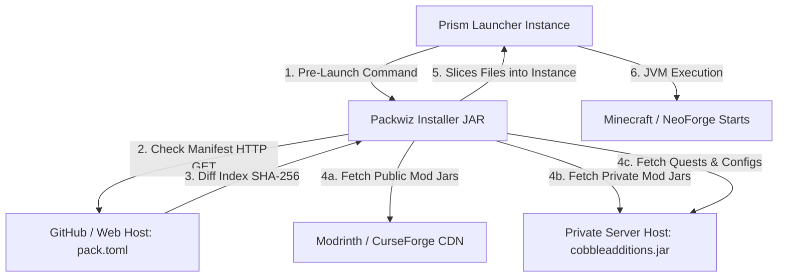

# 🚀 Auto-Updating Instance (Packwiz + Prism Launcher) — Technical Design

This repository hosts the auto-updating modpack configuration for the **SOG Experience** Minecraft Server, a private personal server running Minecraft version **1.21.1** with the NeoForge mod loader. It leverages the open-source modpack manager **Packwiz** integrated directly into **Prism Launcher** to distribute mods, configuration files, FTB quests, and shared waypoints automatically to players.

This document details the architecture, configuration, and implementation plan for creating this auto-updating modpack instance.

---

## ⚙️ Core Architecture & SOG Ecosystem

The update mechanism runs entirely before Minecraft starts, allowing for seamless synchronization of mods, assets, and configurations.



---

## 🛠️ Step-by-Step Setup Guide

Follow this guide to initialize, configure, and publish your auto-updating modpack instance using Packwiz.

### Step 1: Initialize the Local Launcher Directory
1. Open a terminal in the `sog-launcher/` folder.
2. Initialize the Git repository and Packwiz:
   ```powershell
   cd sog-launcher
   git init
   # Download the packwiz executable (packwiz.exe) to this folder
   .\packwiz.exe init --name "SOG Experience" --author "Sendout" --mc-version 1.21.1 --modloader neoforge --loader-version 21.1.218
   ```
   This will create the base `pack.toml` and `index.toml` files.

### Step 2: Configure Ignore Filters
Open the generated `pack.toml` file and append the player data exclusion directives at the end:
```toml
[download]
ignore = [
    "options.txt",
    "optionsof.txt",
    "saves/**",
    "logs/**",
    "screenshots/**",
    "shaderpacks/**",
    "xaerowaypoints/**",
    "journeyMap/waypoints/**"
]
```

### Step 3: Add Public Mods and Resources
* **Add mods from Modrinth/CurseForge**:
   ```powershell
   # Example: Adding Cobblemon and FTB Quests directly from Modrinth
   .\packwiz.exe mr add cobblemon
   .\packwiz.exe mr add ftb-quests
   .\packwiz.exe mr add xaeros-minimap
   ```
   *(Packwiz will create small `.toml` files under `mods/` pointing to the CDN, keeping the repository lightweight).*

### Step 4: Add Your Private Mod (SOG Additions)
1. Create a `custom/` folder inside `sog-launcher/`.
2. Copy the compiled JAR of your mod `cobbleadditions-0.9.1.jar` into `custom/`.
3. Add it to the Packwiz index indicating it is a local file:
   ```powershell
   .\packwiz.exe file add custom/cobbleadditions-0.9.1.jar
   ```

### Step 5: Synchronize Quests (SOG Experience) and Waypoints
1. Copy your processed quest folder into the launcher's `config/` directory:
   `sog-launcher/config/ftbquests/quests/`
2. Register the entire folder in Packwiz so it updates for the players:
   ```powershell
   .\packwiz.exe refresh
   ```
3. Generate your shared waypoints in your client, copy the `normal.txt` file to the path `sog-launcher/xaerowaypoints/Multiplayer_your-ip/dim%0/normal.txt` and execute `.\packwiz.exe refresh`.

### Step 6: Publish the Repository
Create a public repository on GitHub (e.g. `santiagortizgue/sog-experience-launcher`) and push all the files of `sog-launcher/`:
```powershell
git remote add origin https://github.com/santiagortizgue/sog-experience-launcher.git
git branch -M main
git add .
git commit -m "Initial modpack push"
git push -u origin main
```

### Step 7: Configure Prism Launcher on Client Machines
1. Download the lightweight Packwiz bootstrap loader [packwiz-installer-bootstrap.jar](https://github.com/packwiz/packwiz-installer-bootstrap/releases) and place it inside the root directory of your players' Prism instances.
2. Open the instance settings in Prism Launcher, navigate to the **Custom Commands** section, and enable the **Pre-launch command**:
   ```bash
   "$INST_JAVA" -jar packwiz-installer-bootstrap.jar -bootstrap https://raw.githubusercontent.com/santiagortizgue/sog-experience-launcher/main/pack.toml
   ```
3. All set! Every time players launch the instance, Packwiz will update the SOG mod, quests, and official waypoints before the game starts.

---

## 📋 Development Plan

The phased roadmap, deployment objectives, and technical details are documented in [development_plan.md](./development_plan.md).
