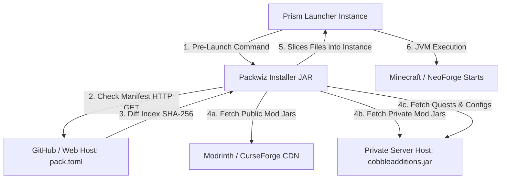

# 🚀 Instancia Auto-Actualizable (Packwiz + Prism Launcher) — Technical Design

This repository hosts the auto-updating modpack configuration for the **SOG Experience** Minecraft Server, a private personal server running Minecraft version **1.21.1** with the NeoForge mod loader. It leverages the open-source modpack manager **Packwiz** integrated directly into **Prism Launcher** to distribute mods, configuration files, FTB quests, and shared waypoints automatically to players.

This document details the architecture, configuration, and implementation plan for creating this auto-updating modpack instance.

---

## ⚙️ Core Architecture & Ecosistema SOG

The update mechanism runs entirely before Minecraft starts, allowing for seamless synchronization of mods, assets, and configurations.




## 🛠️ Step-by-Step Setup Guide

Follow this guide to initialize, configure, and publish your auto-updating modpack instance using Packwiz.

### Paso 1: Inicializar el directorio local del Launcher
1. Abre la terminal de PowerShell en la carpeta `sog-launcher/`.
2. Inicializa el repositorio Git y Packwiz:
   ```powershell
   cd sog-launcher
   git init
   # Descarga el ejecutable de packwiz (packwiz.exe) en esta carpeta
   .\packwiz.exe init --name "SOG Experience" --author "Sendout" --mc-version 1.21.1 --modloader neoforge --loader-version 21.1.218
   ```
   Esto creará los archivos base `pack.toml` e `index.toml`.

### Paso 2: Configurar filtros de ignorado y untracked
Abre el archivo `pack.toml` generado y añade las directivas de exclusión de datos del jugador al final:
```toml
[download]
ignore = [
    "options.txt",
    "optionsof.txt",
    "saves/**",
    "logs/**",
    "screenshots/**",
    "shaderpacks/**",
    "xaerowaypoints/**",
    "journeyMap/waypoints/**"
]
```

### Paso 3: Agregar mods públicos y recursos
* **Añadir mods de Modrinth/CurseForge**:
  ```powershell
  # Ejemplo: Añadir Cobblemon y FTB Quests directamente desde Modrinth
  .\packwiz.exe mr add cobblemon
  .\packwiz.exe mr add ftb-quests
  .\packwiz.exe mr add xaeros-minimap
  ```
  *(Packwiz creará archivos `.toml` pequeños bajo `mods/` que apuntan al CDN, manteniendo el repositorio muy ligero).*

### Paso 4: Añadir tu Mod Privado (SOG Additions)
1. Crea la carpeta `custom/` dentro de `sog-launcher/`.
2. Copia el JAR compilado de tu mod `cobbleadditions-0.9.1.jar` dentro de `custom/`.
3. Agrégalo a la indexación de Packwiz indicando que es un archivo local:
   ```powershell
   .\packwiz.exe file add custom/cobbleadditions-0.9.1.jar
   ```

### Paso 5: Sincronizar Misiones (SOG Experience) y Waypoints
1. Copia tu carpeta de misiones procesadas y limpias a la carpeta `config/` del launcher:
   `sog-launcher/config/ftbquests/quests/`
2. Registra la carpeta entera en Packwiz para que se actualice a los jugadores:
   ```powershell
   .\packwiz.exe refresh
   ```
3. Genera tus waypoints compartidos en tu cliente, copia el archivo `normal.txt` a la ruta `sog-launcher/xaerowaypoints/Multiplayer_tu-ip/dim%0/normal.txt` y ejecuta `.\packwiz.exe refresh`.

### Paso 6: Publicar el Repositorio
Crea un repositorio público o privado en GitHub (ej. `TuUsuario/sog-modpack`) y sube todos los archivos de `sog-launcher/`:
```powershell
git remote add origin https://github.com/TuUsuario/sog-modpack.git
git branch -M main
git add .
git commit -m "Initial modpack push"
git push -u origin main
```

### Paso 7: Configurar Prism Launcher en los Clientes
1. Descarga el cargador liviano de Packwiz [packwiz-installer-bootstrap.jar](https://github.com/packwiz/packwiz-installer-bootstrap/releases) y colócalo dentro de la carpeta raíz de la instancia de Prism de tus jugadores.
2. Abre las opciones de la instancia de Prism Launcher de tus jugadores, ve a la sección **Custom Commands** (Comandos Personalizados) y activa el comando **Pre-launch command**:
   ```bash
   "$INST_JAVA" -jar packwiz-installer-bootstrap.jar -bootstrap https://raw.githubusercontent.com/TuUsuario/sog-modpack/main/pack.toml
   ```
3. ¡Listo! Cada vez que los jugadores inicien la instancia, Packwiz actualizará el mod SOG, las misiones y los waypoints oficiales antes de abrir el juego.

---

## 📋 Plan de Desarrollo

El cronograma de fases, objetivos de despliegue y roadmap técnico se detallan en el documento [development_plan.md](./development_plan.md).
