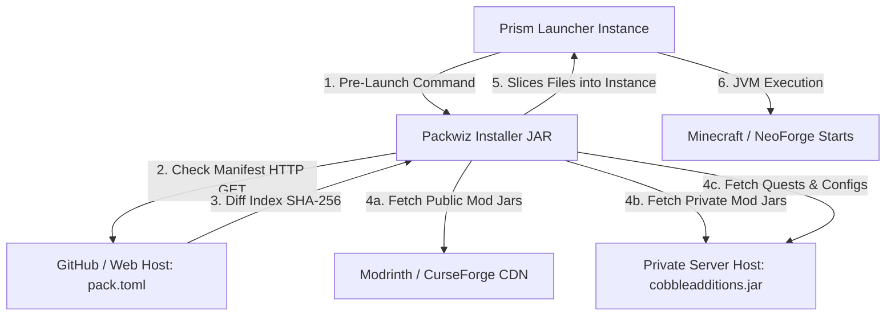

# 🚀 Auto-Updating Instance (Packwiz + Prism Launcher) — Technical Design

This repository hosts the auto-updating modpack configuration for the **SOG Experience** Minecraft Server, a private personal server running Minecraft version **1.21.1** with the NeoForge mod loader. It leverages the open-source modpack manager **Packwiz** integrated directly into **Prism Launcher** to distribute mods, configuration files, FTB quests, and shared waypoints automatically to players.

The primary goal of this repository is to serve as the remote source for player clients to automatically synchronize game assets, mods, and configurations before launching the game, ensuring a seamless and unified multiplayer experience.

---

## ⚙️ Core Architecture & SOG Ecosystem

The update mechanism runs entirely before Minecraft starts, allowing for seamless synchronization of mods, assets, and configurations.

---

## 📋 Setup & Deployment Instructions

For step-by-step instructions on initializing, configuring, and publishing this modpack instance, please refer to the [Development Plan and Setup Guide](development_plan.md).
